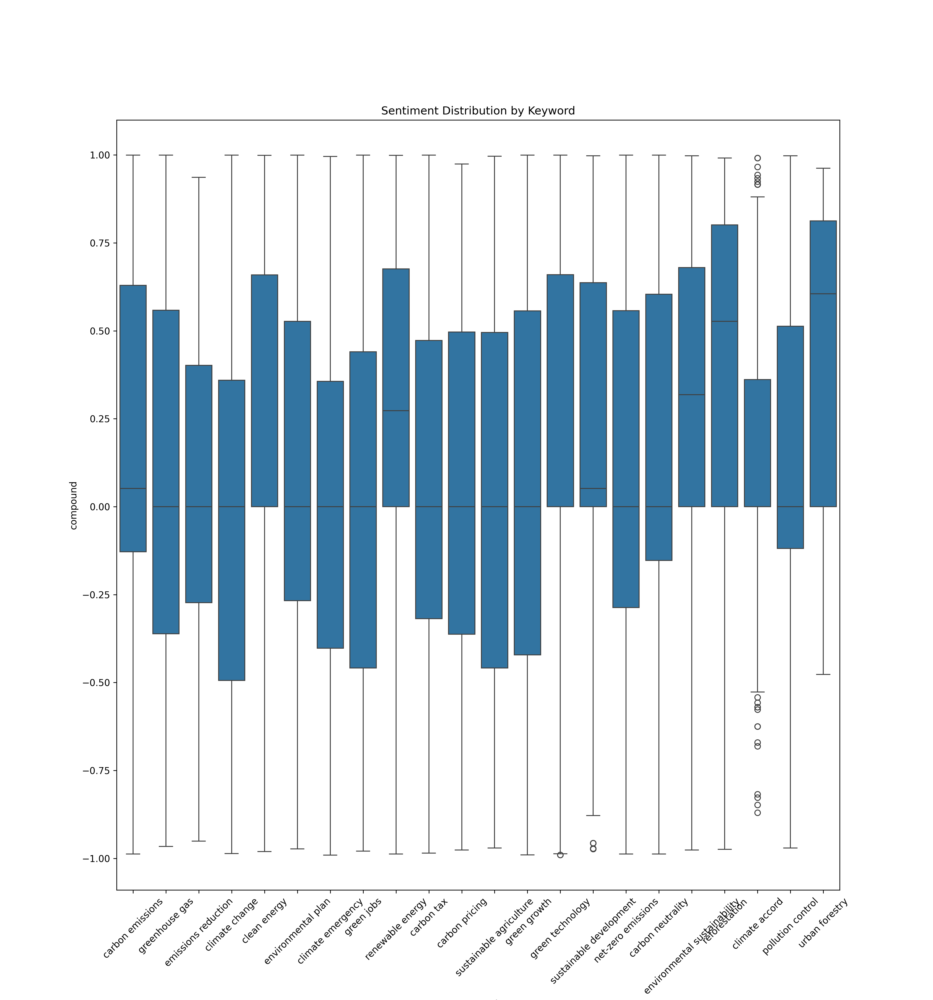
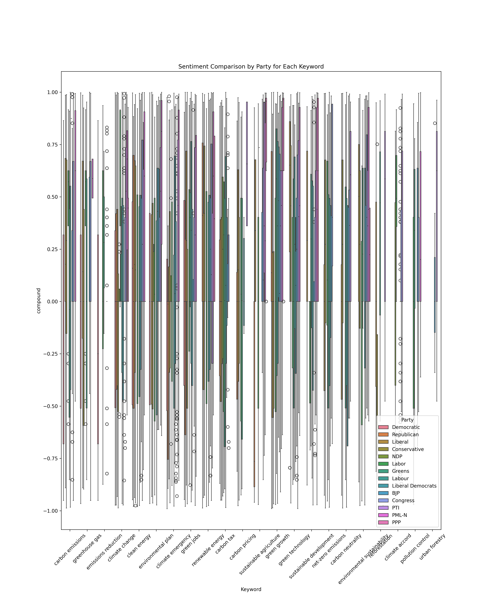

# Evaluating Public Sentiment Dynamics on YouTube Political Discussions

This repository contains the code, data, and documentation for the research project titled **"Evaluating Public Sentiment Dynamics to Political Parties' Sustainability Discussions on YouTube: A Comparative Study of USA, UK, Canada, Australia, India, Pakistan"**. The project analyzes how political actors in six countries discuss sustainability on YouTube, focusing on public sentiment through comment analysis and video statistics.

This project was developed as part of a research initiative.

- **Last Updated**: 10:15 PM CEST, Saturday, August 09, 2025

---

## Project Overview

### Objective
The study examines how political actors use YouTube to communicate sustainability-related messages across six nations (USA, UK, Canada, Australia, India, Pakistan). It analyzes public sentiment through comments, evaluates video engagement metrics (views, likes, comments), and compares these dynamics across different political and cultural contexts.

### Key Research Questions
- How do political parties discuss sustainability on YouTube?
- What are the public sentiment dynamics (positive, neutral, negative) toward these discussions?
- How do engagement metrics and sentiment vary by country, political party, and keyword?

### Methodology
- **Data Collection**: YouTube Data API v3 was used to collect video links, comments, and statistics (views, likes, comments, upload dates).
- **Data Processing**: Data was structured using Pandas and processed for sentiment analysis using the VADER sentiment analysis tool.
- **Data Analysis**: Sentiment categorization, keyword frequency analysis, temporal analysis, and cross-country comparisons were performed.
- **Visualization**: Generated visualizations include bar charts, heatmaps, boxplots, and time-series plots to highlight patterns in keyword usage, sentiment, and engagement.

### Key Findings
- **Keyword Trends**: "Climate Emergency" emerged as the most frequently used keyword from 2019 onwards.
- **Engagement**: Videos with the keyword "Renewable Energy Green Jobs" received the highest view counts.
- **Sentiment**: Comments on sustainability-related videos were predominantly positive, with "Reforestation" receiving the most positive sentiment.
- **Country Insights**: Australian political parties used climate-related keywords most frequently, while the USA's Republican Party had the least content on these topics.

---

## Repository Structure

```
├── Data/
│   ├── comments_output_final.xlsx
│   ├── output_final.xlsx
│   └── ~$comments_output_final.xlsx
├── Results/
│   ├── Reports/
│   │   ├── 01_Videos_Summary_By_Country_Party.xlsx
│   │   ├── 02_Comments_Sentiment_Summary_By_Country_Party.xlsx
│   │   ├── 03_video_popularity_time_series_analysis_by_country.png
│   │   ├── 04_keyword_mentions_over_time.png
│   │   ├── 05_keyword_usage_by_party_and_country.png
│   │   ├── 06_01_like_count_distribution_by_keyword.png
│   │   ├── 06_02_view_count_distribution_by_keyword.png
│   │   ├── 07_sentiment_distribution_by_keyword.png
│   │   ├── 08_sentiment_comparison_by_party_for_each_keyword.png
│   │   └── .DS_Store
├── .gitignore
├── analysis.py
├── countries.xlsx
├── data_files.xlsx
├── data_gathering.py
└── README.md
```

---

## Setup and Installation

### Prerequisites
- Python 3.8 or higher
- A valid YouTube Data API v3 key (set up via Google Cloud Console)
- Required Python libraries (listed below)

### Installation
1. **Clone the Repository**:
   ```bash
   git clone https://github.com/<your-username>/<your-repo-name>.git
   cd <your-repo-name>
   ```

2. **Install Dependencies**:
   Install the required Python libraries using pip:
   ```bash
   pip install pandas google-api-python-client vaderSentiment matplotlib seaborn networkx
   ```

3. **Set Up Input Files**:
   - Ensure the `countries.xlsx` file is in the root directory. This file should contain:
     - A `Keywords` sheet with sustainability-related keywords.
     - A `Channels` sheet with YouTube channel IDs, country, party, and API key information.
   - Update the `api_key_comments` variable in `data_gathering.py` with your YouTube Data API key.

4. **Directory Setup**:
   - The scripts automatically create a `Data/` folder for output files and a `Results/Reports/` folder for visualizations and reports.

---

## Usage

### Step 1: Data Collection
Run the `data_gathering.py` script to collect video links, comments, and statistics from YouTube:
```bash
python data_gathering.py
```
- **Input**: `countries.xlsx` (keywords and channel information)
- **Output**:
  - `Data/output_final.xlsx`: Video metadata
  - `Data/comments_output_final.xlsx`: Comment data with sentiment scores
  - `data_files.xlsx`: File paths for the above outputs
- **Note**: The script handles API quota limits by saving partial data if the limit is exceeded. Ensure a valid API key is provided.

### Step 2: Data Analysis and Visualization
Run the `analysis.py` script to process the data and generate visualizations:
```bash
python analysis.py
```
- **Input**: `data_files.xlsx`, `output_final.xlsx`, `comments_output_final.xlsx`
- **Output**: Excel files and PNG visualizations saved in `Results/Reports/`
- **Visualizations**:
  - Video summaries by country and party
  - Sentiment summaries by country and party
  - Time-series analysis of video popularity
  - Keyword mentions over time
  - Keyword usage by party and country
  - Engagement (likes, views) and sentiment distributions by keyword

---

## Results Visualization

### Video Popularity Over Time (Logarithmic Scale)


### Keyword Mentions Over Time


### Keyword Usage by Party and Country


### Like Count Distribution by Keyword


### View Count Distribution by Keyword


### Sentiment Distribution by Keyword


### Sentiment Comparison by Party for Each Keyword


---

## Limitations
- **API Quota**: The YouTube Data API has a daily limit of 10,000 requests, which may restrict large-scale data collection.
- **Disabled Comments**: Some videos have disabled comments, limiting the sentiment analysis for those videos.
- **Data Scope**: The study focuses on specific keywords and political channels, which may not capture the full spectrum of sustainability discussions.

---

## License
This project is licensed under the MIT License. See the [LICENSE](LICENSE) file for details.

---

## Contact
For questions or collaboration opportunities, please contact:
- **Muhammad Awais**: muhammadawais.de@gmail.com

This project is part of my portfolio, showcasing skills in Python programming, data analysis, sentiment analysis, and data visualization for social media research.